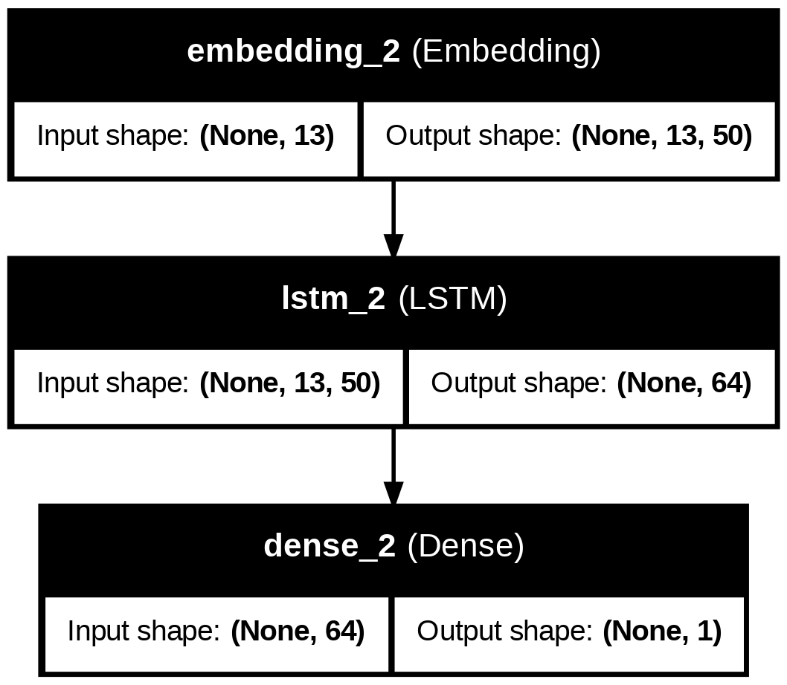

# NLP_Pipeline_steps

Here I have used the following few steps :-
Sentence Tokenization -->  Word Tokenization --> Lower casing words --> Remove Stop words --> Remove Punctuation --> Lemmatization --> Tokenization
---> Padding ---> Embedding ---> use LSTM model (64 nurons)

# Model Architecture

